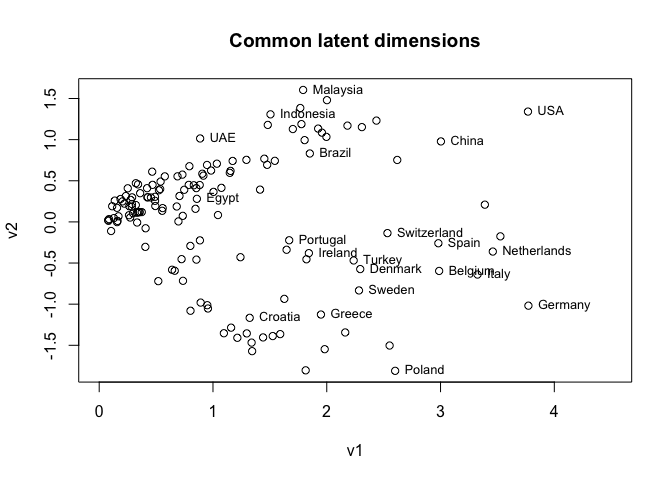

<!-- README.md is generated from README.Rmd. Please edit that file -->

# MultiNeSS

<!-- badges: start -->
<!-- badges: end -->

The R package “multiness” implements model fitting and simulation for
Gaussian and logistic inner product MultiNeSS models for multiplex
networks. The package uses a convex fitting algorithm with fully
adaptive parameter tuning, including options for edge cross-validation.
For more details see [MacDonald et al.,
(2022)](https://doi.org/10.1093/biomet/asab058).

## Installation

You can install “multiness” version 1.0.2 from CRAN using

``` r
install.packages("multiness")
```

You can install the development version of “multiness” from GitHub using

``` r
devtools::install_github("peterwmacd/multiness")
```

## Example

“multiness” includes an example multiplex network of agricultural trade
which is studied in [MacDonald et al.,
(2022)](https://doi.org/10.1093/biomet/asab058). It is easy to import
and to fit a Gaussian MultiNeSS model with adaptive tuning.

``` r
library(multiness)

# import data
data(agri_trade)
dim(agri_trade)
#> [1] 145 145  13

# log transformation for edge weights
A <- log(1+agri_trade)

# model fit
fit <- multiness_fit(A,model="gaussian",self_loops=FALSE,
                     tuning="adaptive",tuning_opts=list(penalty_const=3),
                     optim_opts=list(max_rank=100,return_posns=TRUE))

# inspect fitted latent space dimensions
# common latent space
fit$d1
#> [1] 30
# individual latent spaces
fit$d2
#>  [1]  2  4  4  3  4  8  5  5 16 11  4 12  6

# plot first two common latent dimensions
plot(fit$V_hat[,1:2],main="Common latent dimensions",
     xlab="v1",ylab="v2",xlim=c(0,4.5))
# label a subset of the points
countries <- dimnames(A)[[1]]
do_label <- c(4,5,8,10,11,14,17,19,20,24,25,28,33,34,35,37,39,41,54,61,75)
text(fit$V_hat[do_label,1],fit$V_hat[do_label,2],
     labels=countries[do_label],pos=4,cex=.8)
```


